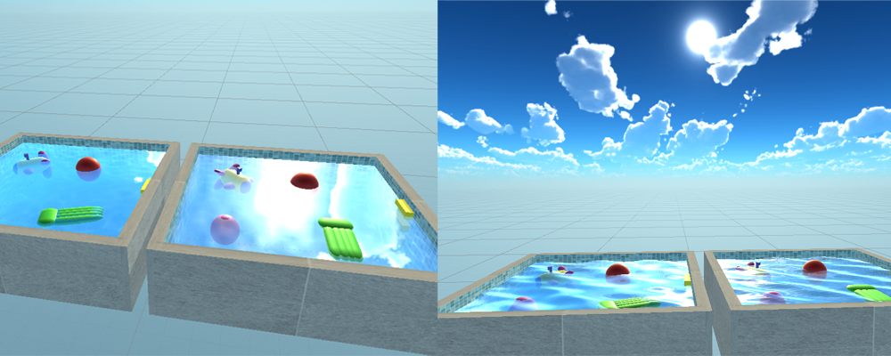

# Water shader in Unity 3D

## Summary
&nbsp;&nbsp;&nbsp;&nbsp;The goal of this project is to create as realistic water as possible using Shaders in Unity3D. Realistic water was achieved by implementing selected water effects:
* [Reflection](https://github.com/leonjovanovic/unity-water-shader/blob/main/README.md#reflection)
* [Refraction](https://github.com/leonjovanovic/unity-water-shader/blob/main/README.md#refraction)
* [Caustics](https://github.com/leonjovanovic/unity-water-shader/blob/main/README.md#caustics)
* [Waves](https://github.com/leonjovanovic/unity-water-shader/blob/main/README.md#waves)
* [Flow](https://github.com/leonjovanovic/unity-water-shader/blob/main/README.md#flow)
* [Underwater fog](https://github.com/leonjovanovic/unity-water-shader/blob/main/README.md#underwater-fog)

[Video](https://github.com/leonjovanovic/unity-water-shader/blob/main/README.md#video)

*Directional water*

## Reflection
&nbsp;&nbsp;&nbsp;&nbsp;The reflection implemented in this paper is a simplified Fresnel's reflection. The reflection will only be applied to the distant environment (skybox), which will be mapped to the surface of the water. It is necessary to calculate the reflected vector in relation to the surface of the water. The reflected vector will be used to sample the skybox. The output color of the observed fragment will be sampled part from skybox.
&nbsp;&nbsp;&nbsp;&nbsp;The water view angle was also taken into account, so that the output color was multiplied by 1 - the angle between the water normal and the vector from the camera to the fragment on the water. This leads to the desired result where if the angle is 0 (the camera is located parallel to the water), the reflection will be 0 and vice versa.

*Reflection on calm and turbulent water*

## Refraction

## Caustics

## Waves

## Flow

## Underwater Fog

## Video

## Future improvements

