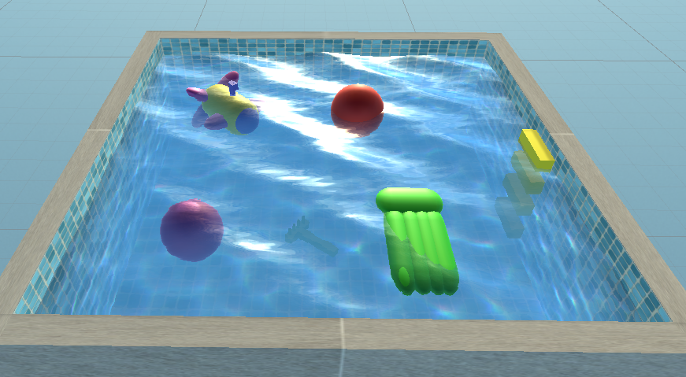
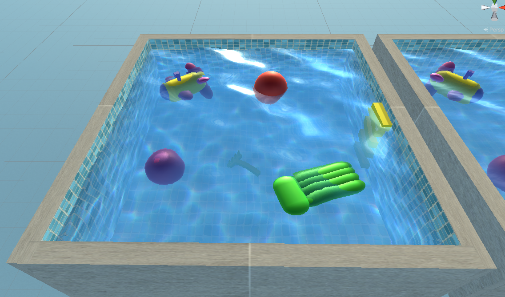
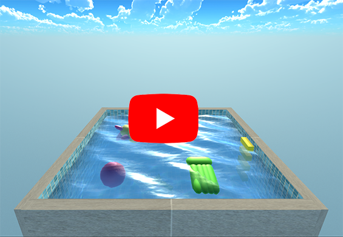

# Water shader in Unity 3D

## Summary
&nbsp;&nbsp;&nbsp;&nbsp;The goal of this project is to create as realistic water as possible using Shaders in Unity3D. Realistic water was achieved by implementing selected water effects:
* [Reflection](https://github.com/leonjovanovic/unity-water-shader/blob/main/README.md#reflection)
* [Refraction](https://github.com/leonjovanovic/unity-water-shader/blob/main/README.md#refraction)
* [Caustics](https://github.com/leonjovanovic/unity-water-shader/blob/main/README.md#caustics)
* [Waves](https://github.com/leonjovanovic/unity-water-shader/blob/main/README.md#waves)
* [Flow](https://github.com/leonjovanovic/unity-water-shader/blob/main/README.md#flow)
* [Underwater fog](https://github.com/leonjovanovic/unity-water-shader/blob/main/README.md#underwater-fog)

[Video](https://github.com/leonjovanovic/unity-water-shader/blob/main/README.md#video)

*Directional water*

## Reflection
&nbsp;&nbsp;&nbsp;&nbsp;The reflection implemented in this paper is a simplified Fresnel's reflection. The reflection will only be applied to the distant environment (skybox), which will be mapped to the surface of the water. It is necessary to calculate the reflected vector in relation to the surface of the water. The reflected vector will be used to sample the skybox. The output color of the observed fragment will be sampled part from skybox.
&nbsp;&nbsp;&nbsp;&nbsp;The water view angle was also taken into account, so that the output color was multiplied by 1 - the angle between the water normal and the vector from the camera to the fragment on the water. This leads to the desired result where if the angle is 0 (the camera is located parallel to the water), the reflection will be 0 and vice versa.

*Reflection on calm and turbulent water*

## Refraction

&nbsp;&nbsp;&nbsp;&nbsp;Effect of refraction was achieved with the use of the so-called DuDv maps (false refraction). It is a texture that contains already calculated derivatives of the water normals. In order to simulate the false refraction, it is necessary to move the initial UV (texture) coordinates so that when we sample the objects using slightly shifted UV coordinates, the objects themselves look shifted.
&nbsp;&nbsp;&nbsp;&nbsp;Refraction also depends on the water turbulence. If the water is calm, the refraction results in a slightly shifted underwater image, but if the water has waves and a surface flow, the refraction is much stronger.
&nbsp;&nbsp;&nbsp;&nbsp;The simplicity of this solution is reflected in the fact that we can use the XY component of the water normals for the displacement that will be added to the original UV coordinates. Such solution gives us efficiency due to fast calculation of normals (via sampled derivatives) and accuracy, because if the water is turbulent, the water normals will also change and thus the refraction. 

*Water refraction*

## Caustics

&nbsp;&nbsp;&nbsp;&nbsp;The algorithm consists of sampling the caustics texture twice with UV coordinates that have different displacements. The RGB components from the two samples needs to be separated to create an effect where different wavelengths of light are refracted differently when passing through water. Finally, it is necessary to mix the two obtained textures.
&nbsp;&nbsp;&nbsp;&nbsp;The UV shift must be different for the two samples to achieve distortion effect. Also the shift in both cases must be a function of time in order to move constantly. An additional parameter s is introduced, which will specify an additional shift to separate the colors. The separation of the RBG component is calculated by moving the UV coordinate by (s, s), (s, -s), (-s, -s) in the case of the R, G, B components, respectively. After that we have the final UV coordinates that we need to sample from the caustic texture. We sample three times for each component and take the R component from the first, G from the second, and B from the third color. Combine all three components into one color and repeat the whole separation process for the UV coordinates of the second sample.
In the end, we combine the two colors and get the final color of the caustic, which we add to the color of the object and get the final color of the object. 

*Water caustics*

## Waves

## Flow

## Underwater Fog

## Video

## Future improvements

